# CABudget Tracker
The CABudget Tracker is an online tool designed to help people organize their money by keeping tabs on earnings and spending. It includes features like secure login to protect user accounts, the ability to add, modify, or delete transactions, and interactive charts or graphs to display spending patterns and financial trends in an easy-to-understand way.

## _Features (for Users)_
**1) User Registration and Login:** The project includes a user registration and login page, as shown in the images below. When accessing the app, users are first directed to the login page, which displays fields for entering a username and password.

If a user does not have an existing account, they can click the "Create Account" link to navigate to the registration page. Here, they are required to input a username, email address, and password.

After submitting their details by clicking "Register," the user must check the terminal where the application is running to copy a verification link and paste it into their browser.

This step confirms and finalizes the registration process. Once completed, the user can log in using their newly created credentials.

**2) User Dashboard:** The dashboard provides a comprehensive financial overview, displaying your total monthly income and expenses alongside the remaining balance (calculated as income minus expenses). For visual learners, the dashboard presents data through interactive charts, including a pie chart that breaks down spending by category and a bar graph that tracks income versus expense trends over multiple months, helping users easily spot patterns in their financial habits.

**3) User Expenses:** The Expenses tab displays a list of all your expenses, which starts empty by default.

Users can click the "Add Expense" button to open a form where they input details such as the expense amount, description, category, and date.

The category field offers six predefined options (visible in the screenshot), with the ability to add more choices through the admin interface. 

After submitting the form, the expense is instantly added to the list in the Expenses tab for easy tracking.

Each item in the list includes an edit button on its far-right side. Clicking this button reopens the entry form, allowing users to either modify the existing details or delete the entry entirely.

The original description 'Gambling' was updated to 'Netflix.' Clicking Submit instantly saves the changes,

while selecting Delete removes the entry entirely and displays a 'Expense removed' confirmation message appears.

**4) User Income:** The Income tab displays a list of all your income, which starts empty by default same as the Expenses tab.

Users can click the "Add Income" button to open a form where they input details such as the income amount, description, category, and date.

The category field offers four predefined options (visible in the screenshot), with the ability to add more choices through the admin interface. 

After submitting the form, the expense is instantly added to the list in the Income tab for easy tracking.

Each item in the list includes an edit button on its far-right side. Clicking this button reopens the entry form, allowing users to either modify the existing details or delete the entry entirely.

The original description 'OnlyFans (example)' was updated to 'Tiktok Live.' Clicking Submit instantly saves the changes,

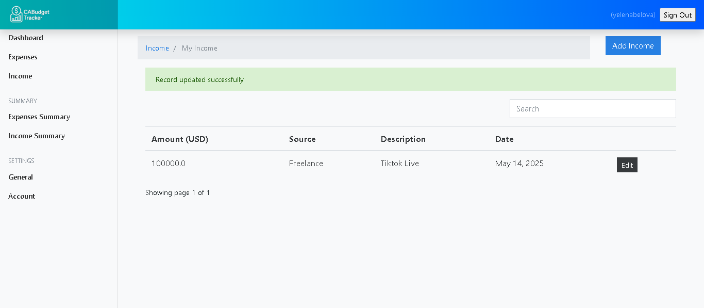

while selecting Delete removes the entry entirely and displays a 'Record removed' confirmation message appears.

**5) Change Currency:** The default currency is set to USD, but users can switch to PHP (Philippine Peso) or any other supported currency via the General Settings section. This allows flexibility for those who prefer to track finances in their local or desired currency.

**5) Username display and Sign-out button:** In all the screenshots above, the right side of the header displays a username and a signout button. Once the button is clicked, the user is logged out and redirected back to the login page with notification "You have been logged out."

## _Features (for Admin)_
**1) Admin Login:**
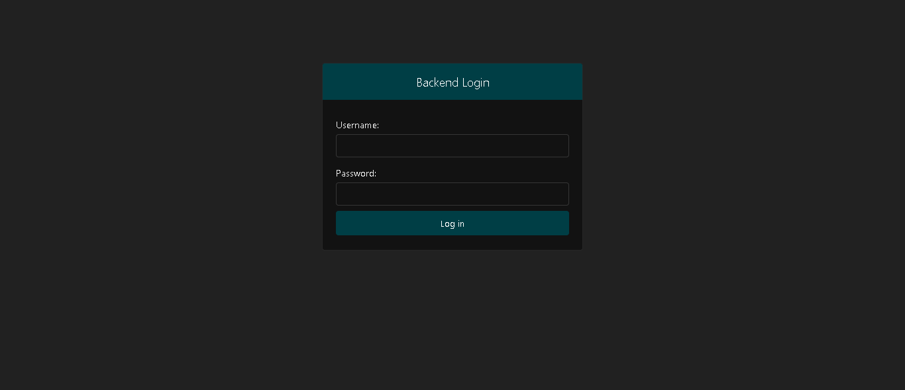

**2) Admin View:**
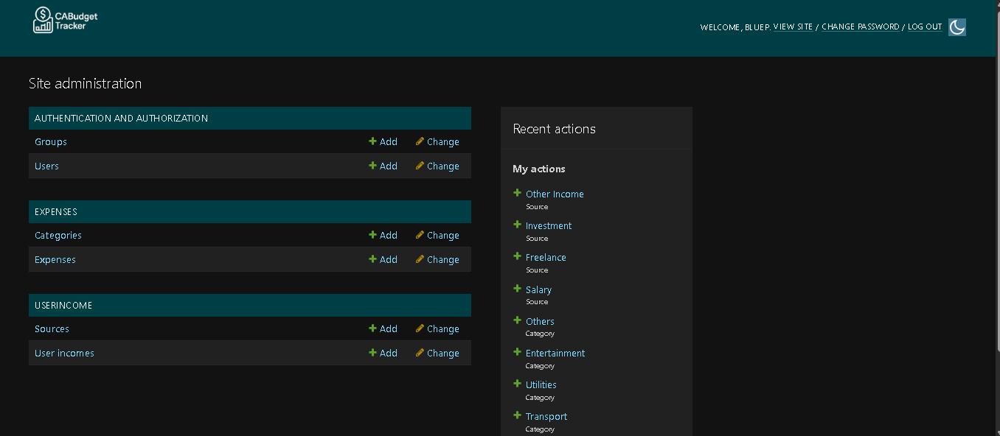

**3) Add/Change Groups:**
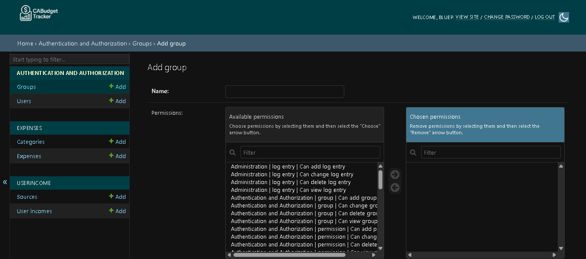
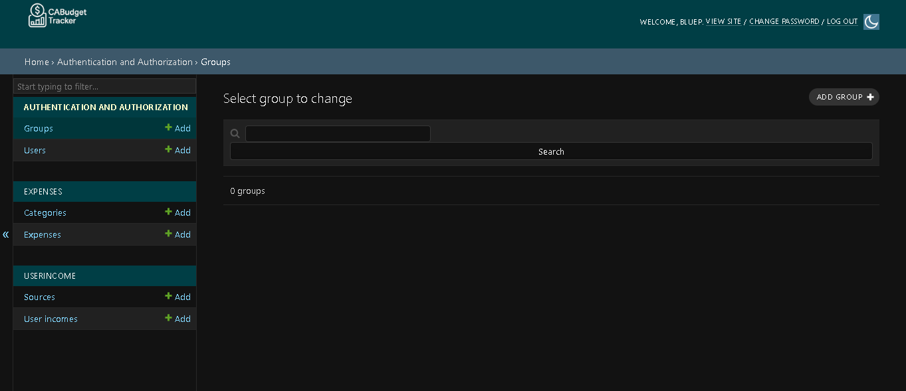

**4) Add/Change Users:**
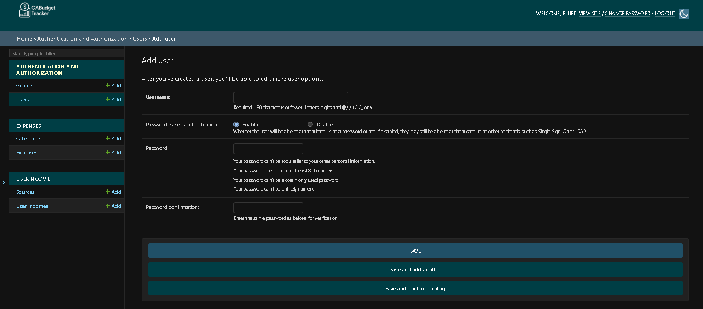
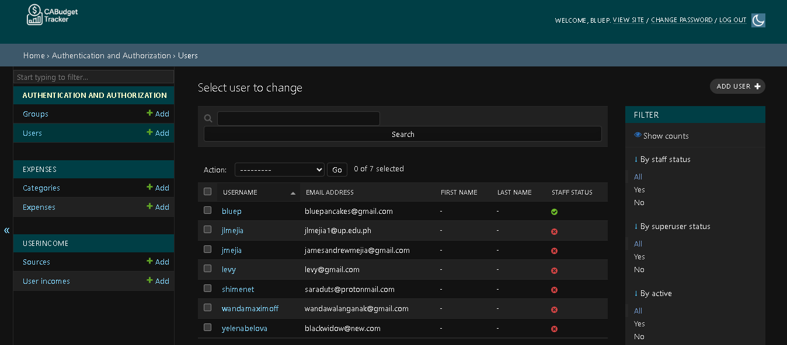

**5) Add/Change Expense Categories:**
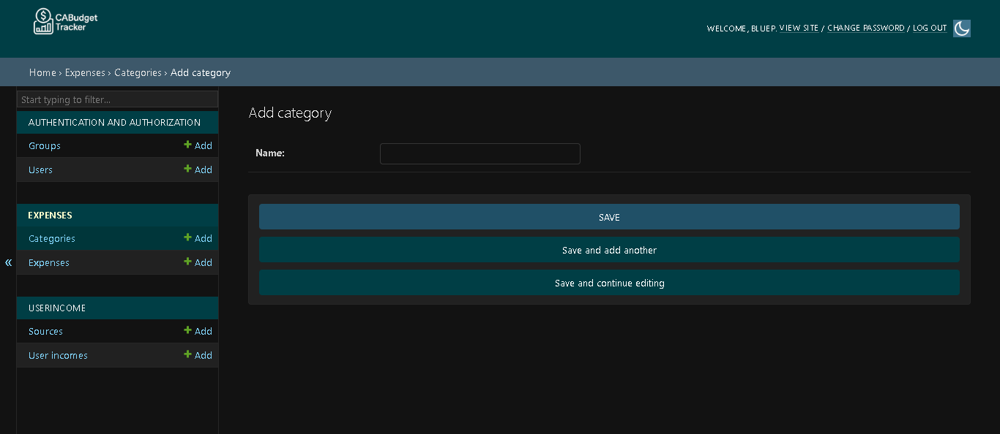
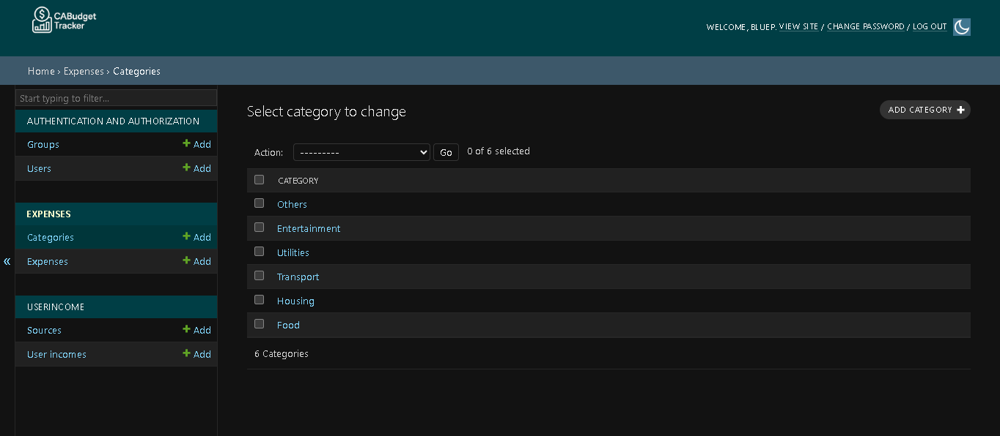

**6) Add/Change Expenses:**
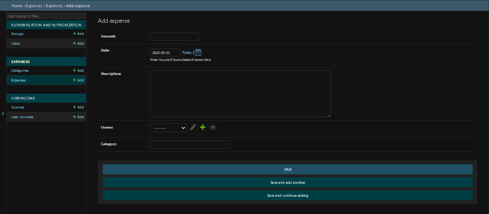
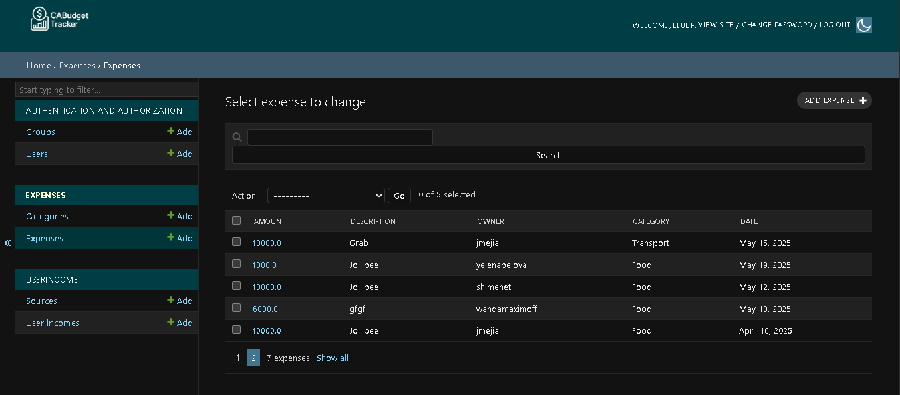

**7) Add/Change Income Sources:**
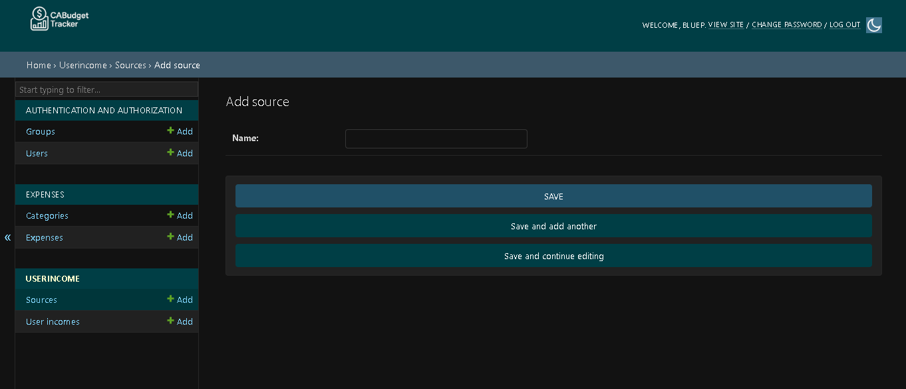
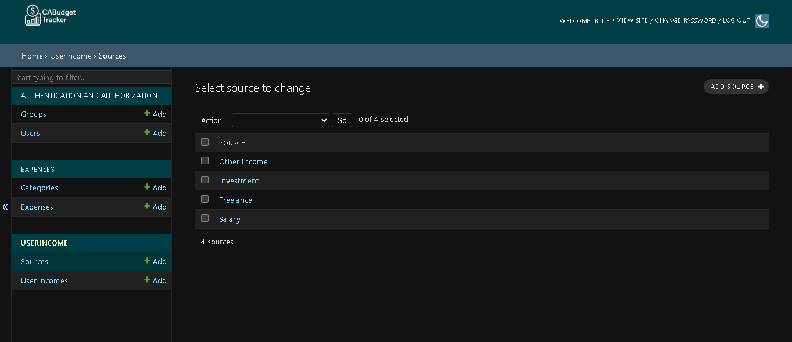

**8) Add/Change Users' Income:**
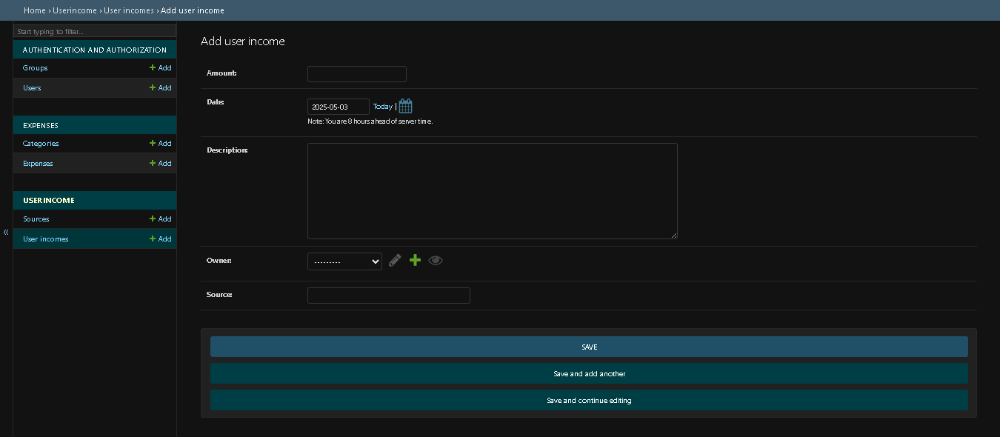
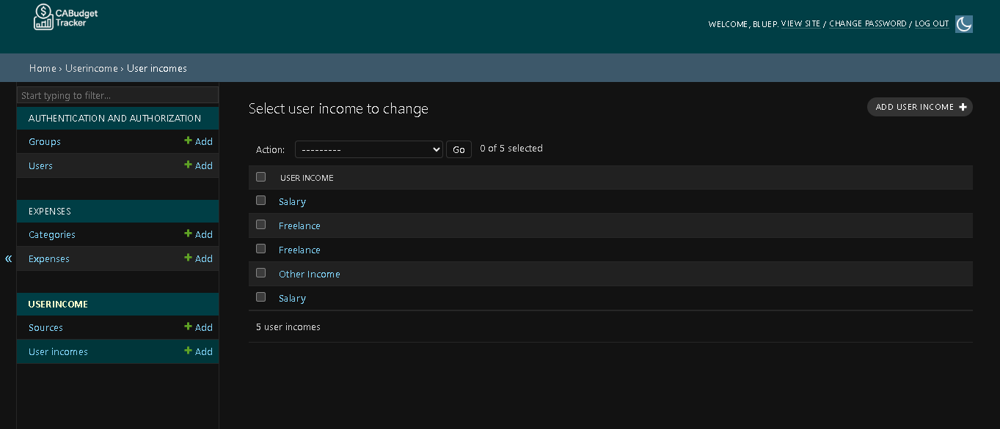

**9) Change Admin Password:**
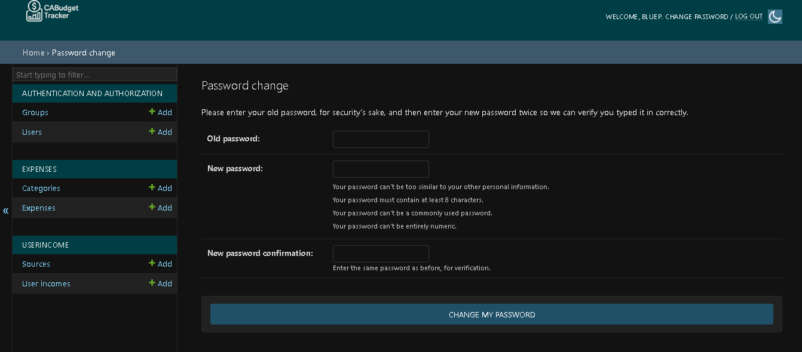

## References  
- [Cryce Truly - Python Django Tutorial Playlist](https://www.youtube.com/watch?v=gAI218HSK8s&list=PLx-q4INfd95G-wrEjKDAcTB1K-8n1sIiz)  

Disclaimer:
The .venv environment is used only to activate the django. This is not guaranteed to work after cloning the repository. It is advisable to delete it and create new environment (python -m venv <preffered env name>). After cloning, please install the following requirements: 
pip install django django_heroku six validate-email
